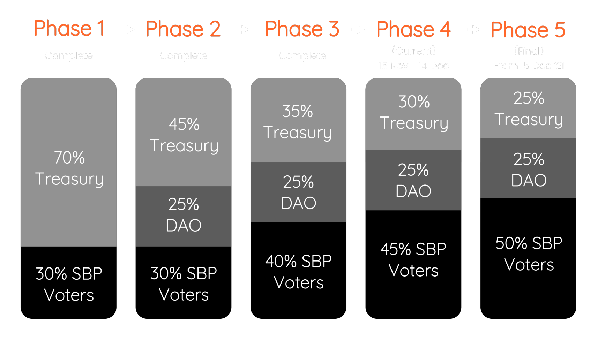
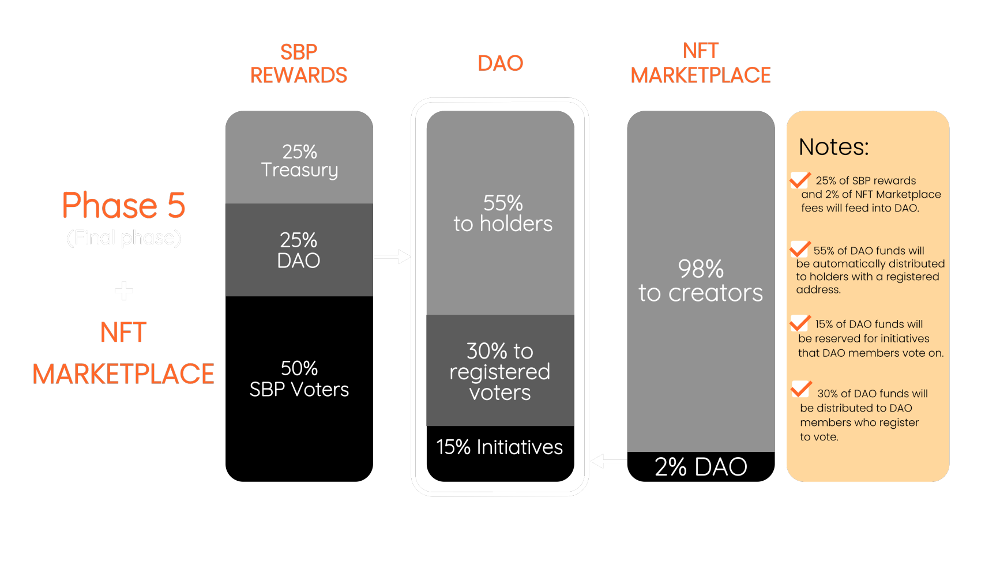

# Decentralised Autonomous Organisation (VITCDAO)

The Vitamin Coin Decentralized Autonomous Organization (VITCDAO) is the first of its kind on VITE. It aims to be a community-driven platform using VITC as a governance token. Registered DAO members will receive income from two sources: one is the aforementioned SBP daily rewards and the other, a split of the 2% sale fee from the proposed VITC NFT market (VITCNFT). This market will be on the VITE network, which will enable fee-less NFT transactions. The distribution structure is outlined in the chart below. This approach allows the DAO to be self-sustaining, by using VITE itself to power the DAO.

<figure><figcaption></figcaption></figure>

<figure><figcaption></figcaption></figure>

#### From January 2022, the distribution of daily SBP rewards (in terms of VITE) will be as follows:&#x20;

* 50% will be sent to VITE holders who vote for the Vitamin Coin SBP&#x20;
* 25% will be reserved in the Treasury&#x20;
* 25% will be sent to the DAO pool In addition, 2% of the fees from NFT sales on the upcoming VITCNFT platform will be sent to the DAO pool.&#x20;

#### These funds are then distributed in the following way:&#x20;

* 55% to holders / DAO members. The amount that each holder receives is proportionate to the amount of VITC they hold.&#x20;
* 30% to registered voters. Votes will be held at regular intervals, and holders / DAO members will have to register at each voting cycle. A significant portion of funds is reserved for registered voters, in order to incentivize voting and participation in DAO governance.&#x20;
* 15% for various initiatives. These can include donations to charities and other organizations that DAO members select during each voting cycle.
