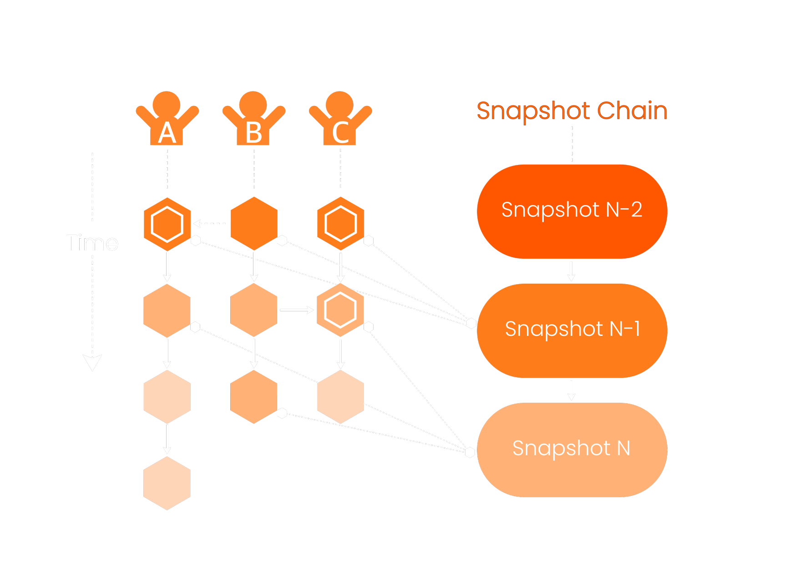

# The Vite platform

VITE is a next-generation high throughput, low latency, scalable network, currently capable of up to 1172 transactions per second. VITE uses a ‘Directed Acyclic Graph’ (DAG) ledger structure that provides each account on the network with its own blockchain. Instead of having miners compete to create blocks, only the account owner can add blocks to his blockchain. This enables comparatively faster transaction times. More generally, the DAG architecture allows for more scalability, less energy usage, no fees, and the possibility of micro-transactions. We believe this system is superior to many alternative cryptocurrency networks.&#x20;

One of the issues of a fee-less DAG is that users can spam the network with transactions, at low cost to themselves (namely, electricity usage). To prevent this, VITE has implemented a new mechanism called "Quota". Quota is the “fuel” that keeps the VITE chain running. It is received by staking a minimum of 134 VITE, and allows a user to bypass the Proof-of-Work (PoW) required for transactions. This significantly hinders spam transactions, by increasing their resource cost.&#x20;

A unique and important structure in VITE is the “snapshot” mechanism: its main function is to keep consensus between VITE’s ledgers, in order to eliminate a weakness of the DAG system.&#x20;

Snapshot blocks are created by nodes that participate in VITE’s consensus. These nodes are called Snapshot Block Producers (SBPs). SBPs create blocks with transactions in them, saving transactions on the blockchain.&#x20;

SBPs are rewarded (in VITE) based on the number of blocks they produce. Not all SBPs are equal, however - significantly more blocks are produced by the top 25 SBPs. This corresponds to greater rewards. SBPs rise up the rankings by receiving votes from VITE holders; each VITE is a vote for an SBP.&#x20;

VITC was sponsored by VITE as an SBP in September 2021. VITE holders were able to support the VITC project by delegating their voting weight towards the Vitamin Coin SBP. Within a month, it had risen up the ranks to become one of the top 10 SBPs on the VITE network. Vitamin Coin receiving the SBP makes us the first meme coin to be self-sufficient without the need to sell the project’s own tokens to advance its development. This allows us to reduce the need for a home-token development fund often seen in crypto communities.

<figure><figcaption></figcaption></figure>
